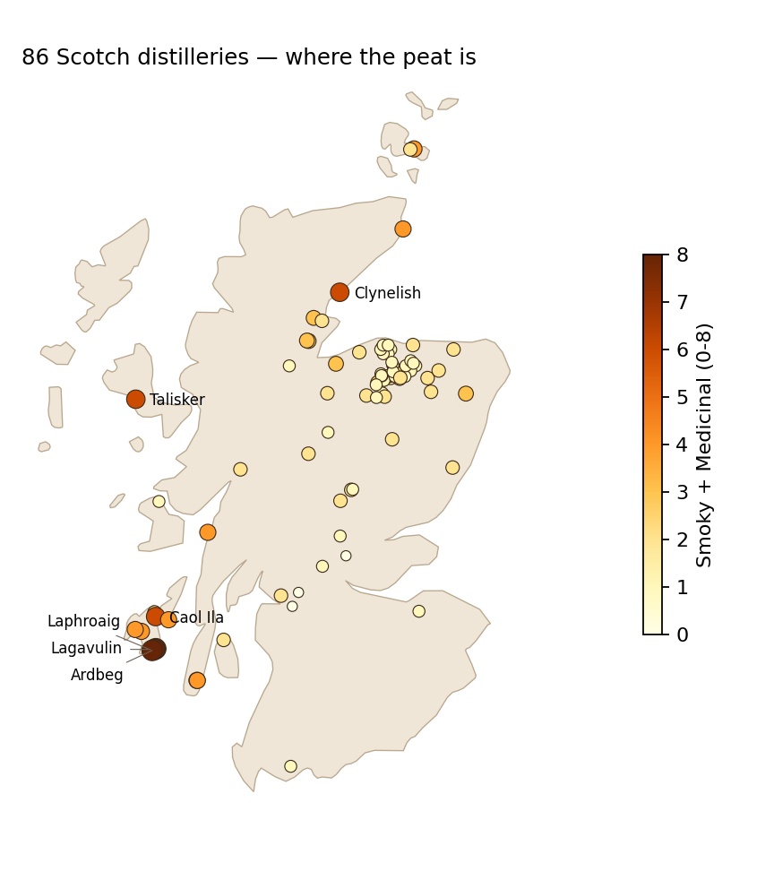
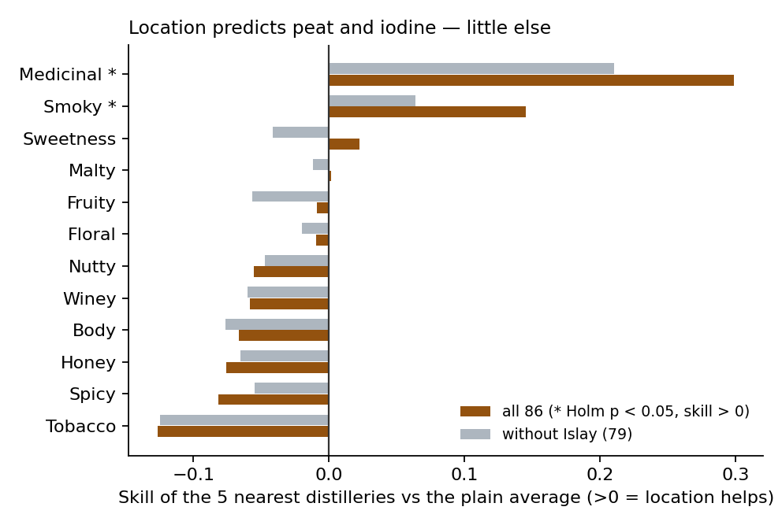

# Does Scotch whisky taste follow geography? — a flavour atlas of 86 distilleries

**Live app:** [setosfk.github.io/projects/scotch-whisky](https://setosfk.github.io/projects/scotch-whisky/) · Python + R · [Türkçe özet ↓](#türkçe-özet)

86 Scotch malt distilleries, each scored 0–4 on 12 flavours (body, sweetness, smoky, medicinal, tobacco, honey,
spicy, winey, nutty, malty, fruity, floral) and placed on the map by postcode. Three questions:
**what shape does flavour have, is taste really regional — or is it just Islay — and does a critic reward any
flavour?** The app turns the atlas into something useful in Türkiye: similar distilleries, the closest taste you
can actually buy here (with TL list prices), a cheese to pair and the nearest shop.

## Results

| Question | Answer | Against |
|---|---|---|
| What shape does flavour have? | Two axes carry 49 %: **PC1 (30 %)** smoke-iodine-body vs floral-sweet-fruity, **PC2 (19 %)** sherry, body, honey | 12 dimensions |
| Are there flavour "families"? | Only one split: silhouette **0.38 at k = 2** (6 heavily peated distilleries vs the other 80) | ≤ 0.15 for every k = 3–8 |
| Is taste regional? | Mantel ρ **0.195**, p = 0.001 (flavour distance vs km, 9,999 permutations) | **without Islay: ρ 0.072, p = 0.15** |
| Can location predict a flavour? | The 5 nearest distilleries beat the plain average for **medicinal (skill +0.30)** and **smoky (+0.15)**, Holm p = 0.012 | 8 of 12 flavours predicted *worse* than the average |
| Do points rise with price? | **+0.65 points per price doubling** (95 % CI 0.58–0.71), Spearman 0.36, n = 2,242 Whisky Advocate reviews | +0.61 adjusted for age |
| Does the critic reward a flavour? | **No attribute survives correction** (72 distilleries with ≥ 5 reviews; strongest medicinal ρ 0.23, Holm p = 0.63) | 12 tests, Holm |



**"Regional style" is mostly Islay's smoke.** Take the 7 Islay distilleries out and the link between distance and
flavour is no longer distinguishable from chance. Neighbours on the map predict iodine and smoke; for body, honey,
spice, sherry or fruit, knowing the five nearest distilleries is worse than knowing nothing. So the app recommends
by flavour distance, never by region or cluster.



## A data-quality finding: the review texts don't belong to their rows

The Whisky Advocate file (2,247 reviews) also has review texts. They look usable, but:

| Check | Rows 1–150 | Rows 151–2,247 |
|---|---|---|
| Text names the bottle's own brand | 32 % | **2.3 %** |
| Text names the brand of a row 1–3 places away | — | **2.2 %** |

After row 150 a text is as likely to mention a neighbouring bottle as its own — the texts were shuffled against the
names in this release. Names, scores and prices *are* consistent (age in the name tracks price, Spearman 0.82), so
the project uses **name, category, points and price only**; the text is never analysed or shown. Bottle names are
linked to atlas distilleries by rules in `data/reference/distillery_names.csv` (1,529 of 1,835 single malts, 83
distilleries); peated side-brands made at an atlas distillery (Octomore, Port Charlotte, Ballechin) are not linked
to the house profile.

## The app

- **Map and search** — colour the 86 distilleries by peat, pairing style or any flavour; click for the profile against the average.
- **By taste** — twelve sliders or four style presets → the closest distilleries, and the closest ones you can buy in Türkiye.
- **Closest taste in Türkiye** — Scotch can only be made in Scotland, so the "equivalent" is the nearest profile among the 13 atlas distilleries on the Turkish shelf (32 single-malt bottles; 16 blends are listed too), with TL list prices (habergazetesi.com.tr, September 2026; Diageo and Pernod Ricard Türkiye). Match = 100 × (1 − distance / largest possible distance).
- **The Turkish shelf** — every bottle with its price and Whisky Advocate score (median of matching reviews), blends included.
- **Cheese pairing** — four rules from Whisky Advocate and Master of Malt, Turkish cheeses first: smoky/medicinal → blue (Divle obruk tulumu, Erzurum küflü civil, Stilton); sherried → aged hard (eski kaşar, Kars gravyeri, Gouda); light → fresh and creamy (Ezine, fresh goat's cheese, Brie); honeyed → aged kaşar or cheddar.
- **Where to buy** — liquor shops nearest to you from OpenStreetMap (Overpass API), queried only when you ask, with a coordinate rounded to ~100 m. No online-shop links: in Türkiye alcohol may not be sold by mail, to under-18s, or at retail between 22:00 and 06:00 (Law 4250, art. 6).

## Run it

```bash
pip install -r python/requirements.txt
# optional Whisky Advocate part: see data/README.md
cd python && python run_analysis.py && python build_web.py && pytest -q tests && cd ..
streamlit run python/app.py                          # Python app

Rscript R/install.R && Rscript R/run_analysis.R      # same statistics in R + parity report
Rscript -e 'shiny::runApp("R")'                      # R app

python -m http.server -d web                         # static app at localhost:8000
```

**Python ↔ R parity:** PCA variances and loadings, Mantel ρ, neighbour skills, the price slope, every Spearman ρ,
the text check and the 1,529 linked reviews agree to 4 decimals. Permutation p-values differ only by their random
draws. Silhouettes for k ≥ 3 differ by up to 0.03: the integer scores give only 66 distinct pairwise distances,
11 of 85 Ward merges tie, and SciPy and R break ties differently — both give 0.3836 at k = 2 and pick it.

## Read with care

- One profile per distillery, from an undocumented tasting: peated and unpeated lines of the same distillery, and change over the years, are invisible. Newer distilleries (e.g. Kilchoman) are missing.
- Coordinates are postcode-level: 86 distilleries sit on 77 points; 12 share a point (fanned out on the map).
- Whisky Advocate is one publication; its prices are US prices at review time. Turkish prices are a news site's compiled list prices and vary by shop.
- Associations only. Pairing styles are rules of thumb (`python/whisky/data.py: style_of`), not a model.

## Layout

```
python/whisky/data.py   load the atlas (KML) and the review list, link names, text check
python/                 run_analysis.py · build_web.py · app.py (Streamlit) · tests/
R/                      whisky_data.R · run_analysis.R · app.R (Shiny) · install.R
data/atlas/             WhiskyOut.kml (the atlas, CC BY-SA 3.0)
data/reference/         hand-built, sourced tables (see data/README.md)
results/                every number above · web/ static app · docs/ figures
```

**Data & licence.** Atlas: Pope, A. (2017). *Scotch Whisky characteristics* [dataset]. University of Edinburgh,
Edinburgh DataShare. [doi:10.7488/ds/1942](https://doi.org/10.7488/ds/1942) — CC BY-SA 3.0; flavour scores as published on the University of
Strathclyde "Nessie" outreach page. The atlas file and everything derived from it (`results/`, `web/data/`) are
shared under **CC BY-SA 3.0**; code is MIT. Map outline: Natural Earth (public domain). Whisky Advocate list:
Kaggle `neilcosgrove/scotch-whiskey-reviews-update-2020`, not redistributed.

---

## Türkçe özet

**Soru:** 86 İskoç damıtımevinin 12 boyutlu tat profilinde nasıl bir yapı var, tat gerçekten bölgeye mi bağlı, ve eleştirmen bir tadı ödüllendiriyor mu?

- **İki eksen yeterli:** tat farklarının %49'u iki eksende — biri duman-iyot-gövde, diğeri şeri-gövde-bal.
- **"Aile" yok, tek ayrım turba:** siluet k = 2'de 0,38 (6 yoğun turbalı damıtımevi ve kalan 80); k = 3–8 için en fazla 0,15. Uygulama bu yüzden bölgeye ya da kümeye göre değil, tat uzaklığına göre öneriyor.
- **"Bölge tadı" büyük ölçüde Islay'in dumanı:** coğrafya–tat ilişkisi (Mantel ρ 0,195, p 0,001) Islay çıkınca ρ 0,072 düzeyine iniyor, p 0,15. En yakın 5 damıtımevi yalnız iyot ve dumanı ortalamadan iyi tahmin ediyor; 12 tattan 8 tanesinde ortalamadan kötü.
- **Fiyat puanı az açıklıyor:** fiyat iki katına çıkınca +0,65 puan (%95 GA 0,58–0,71). Hiçbir tat boyutu damıtımevinin medyan puanıyla anlamlı ilişkili değil.
- **Veri bulgusu:** Whisky Advocate dosyasında inceleme metinleri 150. satırdan sonra şişe adlarıyla eşleşmiyor (kendi markasını anma %2,3; komşu satırın markası %2,2). Metinler kullanılmadı; yalnız ad, kategori, puan ve fiyat.
- Her damıtımevi için: **Türkiye'de alınabilecek en yakın tat** (13 damıtımevinden 32 tek malt şişe, TL liste fiyatıyla; ayrıca 16 harman), **peynir eşleşmesi** (Divle obruk, Erzurum küflü civil, eski kaşar, Kars gravyeri, Ezine…) ve **en yakın satış noktaları** (OpenStreetMap). Türkiye'de alkollü içkinin posta ile satışı, 18 yaş altına satışı ve 22.00–06.00 arası perakende satışı yasak; bu yüzden çevrimiçi satış bağlantısı yok.
